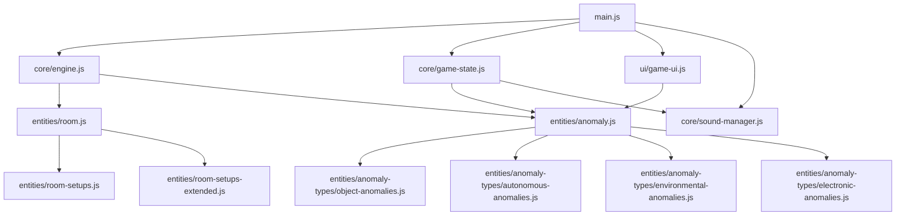

# Design Document: Enhanced Anomaly System

## Overview

The enhanced anomaly system expands the existing anomaly detection game from 7 anomaly types to 30+ unique anomaly types across four categories: Object, Autonomous, Environmental, and Electronic. The system adds four new room types (basement, attic, garage, nursery) and enhances existing rooms with 5+ additional furniture objects per room. The design maintains architectural standards (200-line file cap) and preserves 90%+ test coverage while introducing new gameplay mechanics including anomaly serialization, difficulty tiers, combination anomalies, and visual intensity scaling.

The current codebase has main.js at 245 lines (exceeds cap), anomaly.js at 180 lines (approaching cap), and room-setups.js at 200 lines (at cap). This design addresses decomposition strategies to bring all files under the 200-line limit while adding substantial new functionality.

## Architecture

### High-Level Structure

The system follows a modular architecture with clear separation of concerns:

```
src/
├── core/
│   ├── engine.js              (game loop, camera, renderer)
│   ├── sound-manager.js       (audio system)
│   ├── textures.js            (procedural textures)
│   └── game-state.js          [NEW] (game state management)
├── entities/
│   ├── room.js                (room base class)
│   ├── room-setups.js         (furniture placement - DECOMPOSE)
│   ├── anomaly.js             (anomaly manager - DECOMPOSE)
│   └── anomaly-types/         [NEW]
│       ├── object-anomalies.js
│       ├── autonomous-anomalies.js
│       ├── environmental-anomalies.js
│       └── electronic-anomalies.js
├── ui/
│   ├── game-ui.js             [NEW] (UI state management)
│   ├── report-menu.js         [NEW] (report menu logic)
│   └── shift-report.js        [NEW] (end-game report)
└── main.js                    (entry point - DECOMPOSE)
```

### Decomposition Strategy

To maintain the 200-line file cap, the following decompositions are required:

**main.js (245 lines → 3 files)**
- `main.js` (60 lines): Entry point, initialization, module wiring
- `ui/game-ui.js` (90 lines): Camera switching, report menu, UI state
- `core/game-state.js` (95 lines): Game loop, timer, anomaly spawning, end game logic

**anomaly.js (180 lines → 5 files)**
- `entities/anomaly.js` (120 lines): AnomalyManager core, trigger/resolve orchestration
- `entities/anomaly-types/object-anomalies.js` (80 lines): displaced, extra, missing, painting, tv, books, cushions, etc.
- `entities/anomaly-types/autonomous-anomalies.js` (70 lines): rocking_chair, spinning_fan, dripping_faucet, swinging_light, crawling_shadow
- `entities/anomaly-types/environmental-anomalies.js` (60 lines): temperature_drop, fog_room, red_tint, gravity_shift, time_freeze, static_noise
- `entities/anomaly-types/electronic-anomalies.js` (50 lines): tv_on_empty_room, monitor_glitch, phone_ringing, radio_static, all_electronics_on

**room-setups.js (200 lines → 2 files)**
- `entities/room-setups.js` (150 lines): setupLivingRoom, setupBedroom, setupKitchen (enhanced)
- `entities/room-setups-extended.js` (150 lines): setupOffice, setupBathroom, setupHallway (enhanced), setupBasement, setupAttic, setupGarage, setupNursery

### Module Dependencies



## Components and Interfaces

### AnomalyManager (Refactored)

The AnomalyManager orchestrates anomaly lifecycle and delegates type-specific behavior to category modules.

```javascript
class AnomalyManager {
    constructor(rooms)
    
    // Core methods
    triggerRandomAnomaly(): Anomaly
    resolveAnomaly(roomName: string, type: string): boolean
    
    // New methods
    serialize(): string
    deserialize(json: string): void
    getCompatibleTypes(roomName: string): string[]
    checkConflict(anomaly: Anomaly): boolean
    updateIntensity(deltaTime: number): void
    
    // State
    activeAnomalies: Anomaly[]
    undetectedCount: number
    totalTriggered: number
    totalResolved: number
    roomLog: Record<string, {triggered: number, resolved: number}>
    conflictMatrix: Map<string, Set<string>>
    difficultyWeights: {obvious: number, moderate: number, subtle: number}
}
```

### Anomaly Type Modules

Each category module exports apply/resolve functions for its anomaly types:

```javascript
// object-anomalies.js
export const OBJECT_ANOMALY_TYPES = [
    'displaced', 'extra', 'missing', 'painting', 'tv',
    'chair_floor', 'books_floating', 'lamp_flickering',
    'cushion_displaced', 'door_ajar', 'curtains_moving',
    'mirror_reflection'
];

export function applyObjectAnomaly(room, anomaly) { /* ... */ }
export function resolveObjectAnomaly(room, anomaly) { /* ... */ }

// autonomous-anomalies.js
export const AUTONOMOUS_ANOMALY_TYPES = [
    'rocking_chair', 'spinning_fan', 'dripping_faucet',
    'swinging_light', 'crawling_shadow'
];

export function applyAutonomousAnomaly(room, anomaly) { /* ... */ }
export function resolveAutonomousAnomaly(room, anomaly) { /* ... */ }
export function updateAutonomousAnomaly(anomaly, deltaTime) { /* ... */ }

// environmental-anomalies.js
export const ENVIRONMENTAL_ANOMALY_TYPES = [
    'temperature_drop', 'fog_room', 'red_tint',
    'gravity_shift', 'time_freeze', 'static_noise', 'light'
];

export function applyEnvironmentalAnomaly(room, anomaly) { /* ... */ }
export function resolveEnvironmentalAnomaly(room, anomaly) { /* ... */ }

// electronic-anomalies.js
export const ELECTRONIC_ANOMALY_TYPES = [
    'tv_on_empty_room', 'monitor_glitch', 'phone_ringing',
    'radio_static', 'all_electronics_on'
];

export function applyElectronicAnomaly(room, anomaly) { /* ... */ }
export function resolveElectronicAnomaly(room, anomaly) { /* ... */ }
```

### Room Enhancement Interface

Enhanced rooms expose additional furniture references for anomaly targeting:

```javascript
class Room {
    // Existing properties
    name: string
    dimensions: Vector3
    group: Group
    objects: Mesh[]
    light: PointLight
    
    // Enhanced furniture references (room-specific)
    // Living room
    cushions?: Mesh[]
    books?: Mesh[]
    lamp?: {pole: Mesh, shade: Mesh}
    clock?: Mesh
    tvScreen?: Mesh
    painting?: Mesh
    painting2?: Mesh
    curtains?: Mesh
    mirror?: Mesh
    
    // Kitchen
    faucet?: Mesh
    cabinets?: Mesh[]
    
    // Bedroom
    closet?: Mesh
    dresser?: Mesh
    nightstandLamps?: Mesh[]
    
    // Office
    monitor?: Mesh
    ceilingFan?: Mesh
    bookshelf?: Mesh
    
    // Bathroom
    showerCurtain?: Mesh
    towels?: Mesh[]
    
    // Basement
    waterHeater?: Mesh
    storageBoxes?: Mesh[]
    
    // Attic
    oldFurniture?: Mesh[]
    cobwebs?: Mesh[]
    
    // Garage
    car?: Group
    workbench?: Mesh
    tools?: Mesh[]
    
    // Nursery
    crib?: Mesh
    toys?: Mesh[]
    rockingChair?: Mesh
    mobile?: Group
}
```

### GameState Module

Extracted from main.js to manage game loop and state transitions:

```javascript
class GameState {
    constructor(engine, soundManager, ui)
    
    // State management
    state: 'LOBBY' | 'STUDY' | 'PLAYING' | 'OVER'
    gameTime: number
    
    // Game loop
    startMission(): void
    gameLoop(timestamp: number): void
    endGame(won: boolean): void
    
    // Anomaly spawning
    startAnomalyLoop(): void
    getSpawnDelay(): number
    
    // Time formatting
    formatTime(seconds: number): string
}
```

### UI Module

Extracted from main.js to manage UI interactions:

```javascript
class GameUI {
    constructor(engine, soundManager, gameState)
    
    // Camera controls
    switchCamera(index: number): void
    updateGlitch(): void
    
    // Report menu
    openReportMenu(): void
    closeReportMenu(): void
    submitReport(): void
    
    // Shift report
    showShiftReport(won: boolean): void
    
    // Study mode
    enterStudyMode(): void
    cycleAnomaly(): void
}
```

## Data Models

### Anomaly Data Structure

```javascript
interface Anomaly {
    id: number;                    // Unique identifier (timestamp)
    room: string;                  // Room name key
    type: string;                  // Anomaly type identifier
    category: 'object' | 'autonomous' | 'environmental' | 'electronic';
    difficulty: 'obvious' | 'moderate' | 'subtle';
    target: Mesh | null;           // Target furniture object (if applicable)
    originalState: any;            // State snapshot for restoration
    ghost: Mesh | Group | null;    // Spawned anomaly object (extra/intruder)
    triggerTime: number;           // Timestamp when triggered
    intensity: number;             // Visual intensity multiplier (1.0 baseline)
    animationState?: {             // For autonomous anomalies
        phase: number;
        direction: number;
        speed: number;
    };
}
```

### Room Compatibility Matrix

```javascript
const ROOM_ANOMALY_COMPATIBILITY = {
    'living-room': [
        'displaced', 'extra', 'light', 'intruder', 'missing',
        'painting', 'tv', 'chair_floor', 'books_floating',
        'lamp_flickering', 'cushion_displaced', 'curtains_moving',
        'mirror_reflection', 'rocking_chair', 'swinging_light',
        'crawling_shadow', 'temperature_drop', 'fog_room',
        'red_tint', 'gravity_shift', 'time_freeze', 'static_noise',
        'tv_on_empty_room', 'all_electronics_on'
    ],
    'kitchen': [
        'displaced', 'extra', 'light', 'intruder', 'missing',
        'dripping_faucet', 'temperature_drop', 'fog_room',
        'red_tint', 'gravity_shift', 'time_freeze', 'static_noise'
    ],
    'bedroom': [
        'displaced', 'extra', 'light', 'intruder', 'missing',
        'curtains_moving', 'mirror_reflection', 'swinging_light',
        'crawling_shadow', 'temperature_drop', 'fog_room',
        'red_tint', 'gravity_shift', 'time_freeze', 'static_noise',
        'monitor_glitch', 'all_electronics_on'
    ],
    'office': [
        'displaced', 'extra', 'light', 'intruder', 'missing',
        'books_floating', 'chair_floor', 'spinning_fan',
        'crawling_shadow', 'temperature_drop', 'fog_room',
        'red_tint', 'gravity_shift', 'time_freeze', 'static_noise',
        'monitor_glitch', 'all_electronics_on'
    ],
    'bathroom': [
        'displaced', 'extra', 'light', 'intruder', 'missing',
        'mirror_reflection', 'dripping_faucet', 'temperature_drop',
        'fog_room', 'red_tint', 'gravity_shift', 'time_freeze',
        'static_noise'
    ],
    'hallway': [
        'displaced', 'extra', 'light', 'intruder', 'missing',
        'swinging_light', 'crawling_shadow', 'temperature_drop',
        'fog_room', 'red_tint', 'gravity_shift', 'time_freeze',
        'static_noise'
    ],
    'basement': [
        'displaced', 'extra', 'light', 'intruder', 'missing',
        'dripping_faucet', 'swinging_light', 'crawling_shadow',
        'temperature_drop', 'fog_room', 'red_tint', 'gravity_shift',
        'time_freeze', 'static_noise', 'all_electronics_on'
    ],
    'attic': [
        'displaced', 'extra', 'light', 'intruder', 'missing',
        'rocking_chair', 'swinging_light', 'crawling_shadow',
        'temperature_drop', 'fog_room', 'red_tint', 'gravity_shift',
        'time_freeze', 'static_noise'
    ],
    'garage': [
        'displaced', 'extra', 'light', 'intruder', 'missing',
        'door_ajar', 'temperature_drop', 'fog_room', 'red_tint',
        'gravity_shift', 'time_freeze', 'static_noise',
        'all_electronics_on'
    ],
    'nursery': [
        'displaced', 'extra', 'light', 'intruder', 'missing',
        'rocking_chair', 'swinging_light', 'crawling_shadow',
        'temperature_drop', 'fog_room', 'red_tint', 'gravity_shift',
        'time_freeze', 'static_noise', 'phone_ringing'
    ]
};
```

### Conflict Matrix

Defines mutually exclusive anomaly pairs:

```javascript
const CONFLICT_MATRIX = new Map([
    ['light', new Set(['blackout', 'red_tint'])],
    ['blackout', new Set(['light', 'red_tint'])],
    ['red_tint', new Set(['light', 'blackout'])],
    ['displaced', new Set(['missing', 'extra'])],  // Same target conflicts
    ['missing', new Set(['displaced', 'extra'])],
    ['extra', new Set(['displaced', 'missing'])],
    ['time_freeze', new Set(['rocking_chair', 'spinning_fan', 'dripping_faucet'])],
    ['fog_room', new Set(['static_noise'])],  // Visual conflicts
]);
```

### Difficulty Classification

```javascript
const DIFFICULTY_TIERS = {
    obvious: [
        'intruder', 'extra', 'missing', 'light',
        'all_electronics_on', 'fog_room', 'red_tint'
    ],
    moderate: [
        'displaced', 'painting', 'tv', 'chair_floor',
        'lamp_flickering', 'door_ajar', 'rocking_chair',
        'spinning_fan', 'swinging_light', 'temperature_drop',
        'gravity_shift', 'tv_on_empty_room', 'monitor_glitch',
        'phone_ringing', 'radio_static'
    ],
    subtle: [
        'books_floating', 'cushion_displaced', 'curtains_moving',
        'mirror_reflection', 'dripping_faucet', 'crawling_shadow',
        'time_freeze', 'static_noise'
    ]
};
```

### Combination Anomaly Definitions

```javascript
const COMBINATION_ANOMALIES = {
    power_outage: {
        types: ['light', 'all_electronics_on'],
        description: 'All lights fail and electronics activate'
    },
    poltergeist: {
        types: ['displaced', 'books_floating', 'curtains_moving'],
        description: 'Multiple objects move simultaneously'
    },
    haunting: {
        types: ['intruder', 'crawling_shadow', 'temperature_drop'],
        description: 'Supernatural presence with environmental effects'
    }
};
```

### Serialization Format

```javascript
interface SerializedGameState {
    version: string;
    gameTime: number;
    anomalies: {
        id: number;
        room: string;
        type: string;
        category: string;
        difficulty: string;
        triggerTime: number;
        intensity: number;
        targetIndex: number | null;  // Index in room.objects array
        animationState?: {
            phase: number;
            direction: number;
            speed: number;
        };
    }[];
    roomLog: Record<string, {triggered: number, resolved: number}>;
    stats: {
        undetectedCount: number;
        totalTriggered: number;
        totalResolved: number;
    };
}
```


## Animation Systems

### Autonomous Anomaly Animation

Autonomous anomalies require per-frame updates to maintain continuous motion:

```javascript
// In game loop
function updateAutonomousAnomalies(deltaTime) {
    for (const anomaly of activeAnomalies) {
        if (anomaly.category === 'autonomous') {
            updateAutonomousAnomaly(anomaly, deltaTime);
        }
    }
}

// autonomous-anomalies.js
export function updateAutonomousAnomaly(anomaly, deltaTime) {
    if (!anomaly.animationState) return;
    
    switch (anomaly.type) {
        case 'rocking_chair':
            anomaly.animationState.phase += deltaTime * anomaly.animationState.speed;
            const rockAngle = Math.sin(anomaly.animationState.phase) * 0.15;
            anomaly.target.rotation.x = rockAngle;
            break;
            
        case 'spinning_fan':
            anomaly.animationState.phase += deltaTime * anomaly.animationState.speed;
            anomaly.target.rotation.y = anomaly.animationState.phase;
            break;
            
        case 'dripping_faucet':
            anomaly.animationState.phase += deltaTime;
            if (anomaly.animationState.phase >= 2.0) {  // Drip every 2 seconds
                spawnWaterDrop(anomaly);
                anomaly.animationState.phase = 0;
            }
            break;
            
        case 'swinging_light':
            anomaly.animationState.phase += deltaTime * anomaly.animationState.speed;
            const swingAngle = Math.sin(anomaly.animationState.phase) * 0.3;
            anomaly.target.rotation.z = swingAngle;
            break;
            
        case 'crawling_shadow':
            anomaly.animationState.phase += deltaTime * anomaly.animationState.speed;
            const shadowX = Math.sin(anomaly.animationState.phase) * 5;
            anomaly.ghost.position.x = shadowX;
            break;
    }
}
```

### Visual Intensity Scaling

Anomalies become more visually intense the longer they remain undetected:

```javascript
function updateIntensity(deltaTime) {
    const currentTime = Date.now();
    
    for (const anomaly of this.activeAnomalies) {
        const elapsedSeconds = (currentTime - anomaly.triggerTime) / 1000;
        
        if (elapsedSeconds >= 60) {
            anomaly.intensity = 1.5;  // 50% increase after 60s
        } else if (elapsedSeconds >= 30) {
            anomaly.intensity = 1.2;  // 20% increase after 30s
        }
        
        applyIntensityModifier(anomaly);
    }
}

function applyIntensityModifier(anomaly) {
    switch (anomaly.type) {
        case 'light':
            // Increase brightness/color saturation
            anomaly.target.intensity *= anomaly.intensity;
            break;
            
        case 'extra':
        case 'intruder':
            // Increase opacity or size
            if (anomaly.ghost) {
                anomaly.ghost.scale.setScalar(anomaly.intensity);
            }
            break;
            
        case 'lamp_flickering':
            // Increase flicker frequency
            anomaly.animationState.speed *= anomaly.intensity;
            break;
    }
}
```

### Sound Integration

Sound effects are triggered based on anomaly type and camera distance:

```javascript
// In AnomalyManager.triggerRandomAnomaly()
function triggerRandomAnomaly() {
    // ... existing logic ...
    
    // Trigger sound effect
    this.playSoundForAnomaly(anomaly);
    
    return anomaly;
}

function playSoundForAnomaly(anomaly) {
    const soundMap = {
        'phone_ringing': 'phone_ring',
        'dripping_faucet': 'water_drip',
        'radio_static': 'static_noise',
        'door_ajar': 'door_creak',
        'rocking_chair': 'wood_creak'
    };
    
    const soundId = soundMap[anomaly.type];
    if (soundId) {
        const distance = calculateDistanceToCamera(anomaly);
        const volume = Math.max(0, 1 - distance / 20);  // Falloff over 20 units
        soundManager.playSound(soundId, volume);
    }
}
```


## Correctness Properties

A property is a characteristic or behavior that should hold true across all valid executions of a system—essentially, a formal statement about what the system should do. Properties serve as the bridge between human-readable specifications and machine-verifiable correctness guarantees.

### Property 1: Room Compatibility Enforcement

For any anomaly triggered in any room, the anomaly type must be present in that room's compatibility list.

**Validates: Requirements 1.2, 11.2, 18.5**

### Property 2: Anomaly Application Produces Detectable Change

For any anomaly type, applying that anomaly to a room must produce a detectable change in the room's state (visual, audio, or object properties).

**Validates: Requirements 1.4**

### Property 3: Autonomous Anomaly State Updates

For any autonomous anomaly, calling the update function with a positive delta time must modify the anomaly's animation state.

**Validates: Requirements 1.5, 3.6**

### Property 4: Spawn Delay Within Range

For any call to getSpawnDelay(), the returned value must be between 15000 and 25000 milliseconds.

**Validates: Requirements 11.1**

### Property 5: No Duplicate Types Per Room

For any room, no two active anomalies in that room can have the same anomaly type.

**Validates: Requirements 11.3**

### Property 6: Serialization Round Trip

For any game state with active anomalies, serializing then deserializing must produce an equivalent game state with the same anomalies, room log, and statistics.

**Validates: Requirements 12.3**

### Property 7: Deserialization Error Handling

For any malformed JSON string, attempting to deserialize must return a descriptive error message rather than throwing an exception or producing invalid state.

**Validates: Requirements 12.5**

### Property 8: Sound Volume Distance Falloff

For any anomaly with a sound effect, the calculated volume must decrease monotonically as the distance from the camera increases.

**Validates: Requirements 13.6**

### Property 9: Difficulty Distribution

For any sequence of 100 anomaly spawns, the distribution of difficulties must approximate 40% obvious, 40% moderate, and 20% subtle (within 10% tolerance).

**Validates: Requirements 14.2**

### Property 10: No Same-Target Conflicts

For any furniture object, no two active anomalies can target the same object if their types conflict (displaced/missing/extra).

**Validates: Requirements 20.2, 20.3**

### Property 11: Conflict Resolution Selects Alternative

For any anomaly type that conflicts with an active anomaly in the target room, the system must select a different non-conflicting type from the room's compatibility pool.

**Validates: Requirements 20.4**


## Error Handling

### Anomaly Application Failures

When applying an anomaly fails (e.g., target furniture not found), the system should:
1. Log a warning with anomaly type and room name
2. Remove the anomaly from activeAnomalies
3. Decrement undetectedCount
4. Not count the anomaly toward totalTriggered
5. Continue normal operation without crashing

```javascript
try {
    applyAnomaly(room, anomaly);
} catch (error) {
    console.warn(`Failed to apply ${anomaly.type} in ${anomaly.room}:`, error.message);
    this.activeAnomalies = this.activeAnomalies.filter(a => a.id !== anomaly.id);
    this.undetectedCount = Math.max(0, this.undetectedCount - 1);
    return null;
}
```

### Deserialization Failures

When deserializing game state fails, the system should:
1. Return a descriptive error object with the failure reason
2. Not modify existing game state
3. Allow the game to continue with current state

```javascript
deserialize(json) {
    try {
        const data = JSON.parse(json);
        if (!data.version || !data.anomalies) {
            return { error: 'Invalid game state format: missing required fields' };
        }
        // ... restore state ...
        return { success: true };
    } catch (error) {
        return { error: `Deserialization failed: ${error.message}` };
    }
}
```

### Missing Furniture References

When an anomaly targets furniture that doesn't exist in the room:
1. Skip applying that anomaly type
2. Select an alternative compatible type
3. Log a warning for debugging

```javascript
if (anomaly.type === 'clock_backwards' && !room.clock) {
    console.warn(`Clock not found in ${room.name}, selecting alternative anomaly`);
    const alternativeTypes = this.getCompatibleTypes(room.name)
        .filter(t => t !== 'clock_backwards');
    anomaly.type = alternativeTypes[Math.floor(Math.random() * alternativeTypes.length)];
}
```

### Animation State Corruption

When autonomous anomaly animation state becomes invalid:
1. Reset animation state to default values
2. Log a warning
3. Continue animation from reset state

```javascript
if (!anomaly.animationState || typeof anomaly.animationState.phase !== 'number') {
    console.warn(`Invalid animation state for ${anomaly.type}, resetting`);
    anomaly.animationState = { phase: 0, direction: 1, speed: 1.0 };
}
```

### Conflict Matrix Violations

When attempting to trigger a conflicting anomaly:
1. Check conflict matrix before applying
2. Select alternative non-conflicting type
3. If no alternatives exist, skip spawning this cycle

```javascript
const conflicts = this.conflictMatrix.get(selectedType) || new Set();
const hasConflict = this.activeAnomalies.some(a => 
    a.room === roomName && conflicts.has(a.type)
);

if (hasConflict) {
    const alternatives = compatibleTypes.filter(t => 
        !conflicts.has(t) && !this.activeAnomalies.some(a => a.type === t && a.room === roomName)
    );
    if (alternatives.length === 0) {
        console.warn(`No non-conflicting anomalies available for ${roomName}`);
        return null;
    }
    selectedType = alternatives[Math.floor(Math.random() * alternatives.length)];
}
```

## Testing Strategy

### Dual Testing Approach

The testing strategy employs both unit tests and property-based tests to achieve comprehensive coverage:

- **Unit tests**: Verify specific examples, edge cases, error conditions, and integration points
- **Property tests**: Verify universal properties across randomized inputs (minimum 100 iterations per test)

Both approaches are complementary and necessary. Unit tests catch concrete bugs in specific scenarios, while property tests verify general correctness across a wide input space.

### Property-Based Testing Configuration

**Library**: fast-check (JavaScript property-based testing library)

**Configuration**:
```javascript
import fc from 'fast-check';

// Minimum 100 iterations per property test
const testConfig = { numRuns: 100 };

// Tag format for traceability
// Feature: enhanced-anomaly-system, Property {number}: {property_text}
```

**Example Property Test**:
```javascript
import { describe, it, expect } from 'vitest';
import fc from 'fast-check';

describe('Feature: enhanced-anomaly-system, Property 1: Room Compatibility Enforcement', () => {
    it('should only trigger anomalies compatible with the target room', () => {
        fc.assert(
            fc.property(
                fc.constantFrom(...Object.keys(rooms)),
                (roomName) => {
                    const anomaly = anomalyManager.triggerRandomAnomaly();
                    const compatibleTypes = ROOM_ANOMALY_COMPATIBILITY[roomName];
                    expect(compatibleTypes).toContain(anomaly.type);
                }
            ),
            { numRuns: 100 }
        );
    });
});
```

### Unit Testing Focus Areas

Unit tests should focus on:

1. **Specific Anomaly Type Examples** (Requirements 2.1-2.8, 3.1-3.5, 4.1-4.6, 5.1-5.5)
   - Test each of the 30+ anomaly types can be applied and resolved
   - Verify visual/behavioral changes occur
   - Check that original state is restored on resolution

2. **Room Setup Verification** (Requirements 6.2-6.7, 7.1-7.4)
   - Test each room type creates expected furniture objects
   - Verify furniture references are properly assigned
   - Check minimum furniture count per room

3. **UI Integration** (Requirements 10.1-10.5, 19.1-19.5)
   - Test report menu displays all anomaly types
   - Verify category organization and sorting
   - Check keyboard navigation support
   - Test study mode cycling functionality

4. **Edge Cases**
   - Empty room (no furniture)
   - Maximum anomalies (5 active)
   - Serialization of empty state
   - Conflict resolution with no alternatives
   - Missing furniture references

5. **Error Conditions**
   - Malformed JSON deserialization
   - Invalid anomaly type
   - Null room reference
   - Corrupted animation state

### Property Testing Focus Areas

Property tests should focus on:

1. **Room Compatibility** (Property 1)
   - Generate random rooms and verify triggered anomalies are compatible

2. **Anomaly Application** (Property 2)
   - Generate random anomaly types and verify detectable changes occur

3. **Animation Updates** (Property 3)
   - Generate random autonomous anomalies and verify state changes

4. **Spawn Timing** (Property 4)
   - Generate many spawn delays and verify range constraints

5. **Duplicate Prevention** (Property 5)
   - Generate multiple anomalies per room and verify no duplicates

6. **Serialization Round Trip** (Property 6)
   - Generate random game states and verify serialize/deserialize equivalence

7. **Error Handling** (Property 7)
   - Generate random malformed JSON and verify graceful error handling

8. **Sound Distance Falloff** (Property 8)
   - Generate random distances and verify monotonic volume decrease

9. **Difficulty Distribution** (Property 9)
   - Generate 100 anomalies and verify statistical distribution

10. **Conflict Prevention** (Properties 10-11)
    - Generate conflicting anomaly pairs and verify prevention/resolution

### Test Coverage Requirements

- **Logic modules** (anomaly.js, anomaly-types/*.js, game-state.js): 90% line coverage
- **UI modules** (game-ui.js, report-menu.js, shift-report.js): 80% line coverage
- **Room setup modules** (room-setups.js, room-setups-extended.js): 85% line coverage

### Regression Testing

All 131 existing tests must continue to pass after refactoring:
- Existing anomaly tests (displaced, extra, light, intruder, missing, painting, tv)
- Existing room tests (6 room types)
- Engine tests (camera switching, rendering)
- Sound manager tests

### Integration Testing

Test cross-module interactions:
- GameState → AnomalyManager → Anomaly Types
- GameUI → AnomalyManager (report submission)
- Engine → Room → Room Setups
- AnomalyManager → SoundManager (sound triggering)

### Performance Testing

While not part of automated unit tests, manual performance verification should ensure:
- 60 FPS maintained with 5 active anomalies
- Serialization completes in <100ms
- Room switching completes in <50ms
- No memory leaks over 2-hour game session

